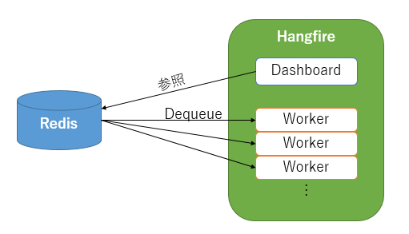
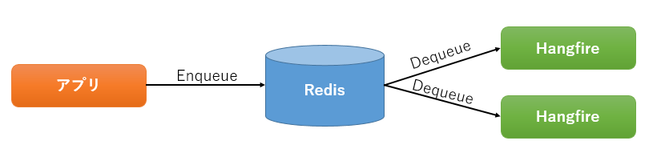
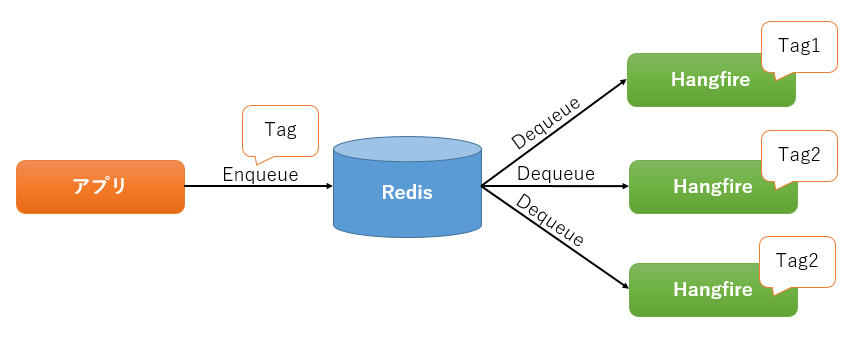

# Hangfire について
## 構成
Hangfire の構成は、下図のようにアプリから Redis に対して Enqueue し、Hangfire のサーバーで Queue を元に処理を行います。  

Hangfire のサーバーでは、Queue の状況を監視できる Dashboard と、キューの処理を行う Worker が動作しています。  

サーバーは、ASP.NET Core で作成したものを、Topshelf を使用して Windows サービス化しています。  
IIS で Hangfire を動作させると、アプリケーションプール停止時に Worker の処理の終了を待ってくれないため、Windows サービスとして動作させています。  

## スケールアウトについて
Hangfire は単純にサーバー台数を増やすことでスケールアウトできます。  
この場合、Queue の同期は自動で行われます。  

また、Queue にタグを付けることによって、タグごと処理を行うことができます。  

## リンク
- [公式サイト](https://www.hangfire.io/)
- [公式ドキュメント](http://docs.hangfire.io/en/latest/index.html)
